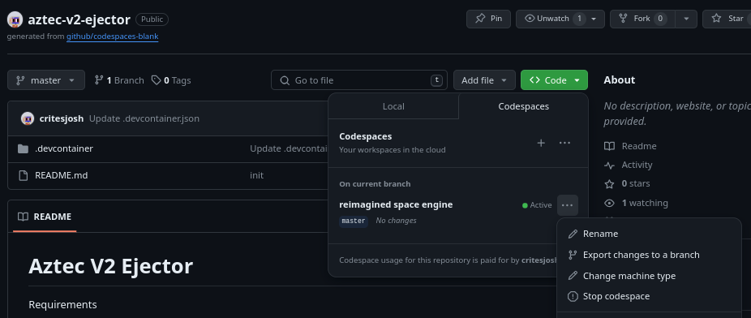

# Aztec V2 Ejector

Requirements

- You'll need to have docker installed: https://docs.docker.com/engine/install
- You'll need a private key funded with at least 0.2 ETH.
- You'll need a machine with at least 8GB memory, 5GB storage space, and the bandwidth/patience to download 5GB.


## Ejecting

To exit your funds from the old.zk.money, you will have to run a few commands on your device to get an instance of the rollup running so you can interact with it to withdraw funds. First, open the command-line interface on your device. Then, copy the following command directly into the CLI and press enter:

```bash
docker run -ti --rm -p8081:8081 -p3001:3001 -e PRIVATE_KEY=<funded-key-to-pay-rollup-fee> aztecprotocol/a2-ejector
```

This launches a container exposing the rollup (we call it Falafel) on port 8081, and zk.money the website, on port 3001. The private key associated with your account must have enough funds to pay the cost of a rollup. Once Falafel has bootstrapped, zk-money will be served on your device, at http://localhost:3001 You can now use zk.money as usual. You will need to wait for your account to sync in the browser.

Specifying gas limit and max fee:

The ejector defaults to a gas limit of 2,000,000 and a max price of 100,000,000,000 (100 gwei). This requires your account to have a minimum of 0.2 ETH available to eject, and that it's probably only economically viable to eject if the amount is greater than ~0.1 ETH. If needed you could override as follows (but might require a higher balance on your account).

```bash
docker run -ti --rm -p8081:8081 -p3001:3001 -e GAS_LIMIT=3000000 -e MAX_PROVIDER_GAS_PRICE=200000000000 -e PRIVATE_KEY=<funded-key-to-pay-rollup-fee> aztecprotocol/a2-ejector
```

## Running in Github Codespaces

If you are running in a codespace, you may need to manually update the machine type for better performance. I recommending choosing the largest machine that you can, so that it runs as smoothly as possible.



### Set localStorage

For the UI to work when being served by a codespace, we have to manually set some `localStorage` variables.

In the zk.money web app page, forwarded from your codespace port 3001 (e.g, https://reimagined-space-engine-97gwrjj6jwxfxgvv-3001.app.github.dev/), open the developer console with `Ctrl+Shift+I`

In the Console, enter 

```js
localStorage.setItem("zm_rollupProviderUrl", "https://reimagined-space-engine-97gwrjj6jwxfxgvv-8081.app.github.dev")
```
and 

```js
localStorage.setItem("zm_graphqlEndpoint", "https://reimagined-space-engine-97gwrjj6jwxfxgvv-8081.app.github.dev/graphql")
```

**Replace the url with the url of your codespace. You can find the url in the Ports tab of the codespace.**


You will also need to set the port visibility to `public` on port 8081 in the Codespace Ports tab.


then refresh the page. This will set the environment variables when the application loads.

You should now be able to login to zk.money with your Metamask or wallet connect account.

https://old.zk.money/
